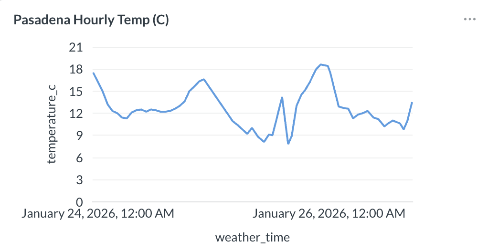

# Modern Analytics Pipeline

## Project Purpose

The purpose of this project is to create a **modern analytics pipeline**.

**Apache Airflow** orchestrates the pipeline. It ingests raw data from **open-meteo** (a weather API), transforms the data with a DAG written in Python, stores the analytics data in **ClickHouse**, and then visualizes it with **Metabase**.

---

## Project Goals

The major goals were to demonstrate:

- Production-style orchestration with Airflow
- OLAP-optimized storage with ClickHouse
- End-to-end data visibility (DAG → database → dashboard)

---

## What This Project Demonstrates

- End-to-end ELT pipeline design
- Clear separation of orchestration, storage, and visualization
- OLAP-appropriate database choices
- Dockerized local development environment
- Production-style observability

---

## Architectural Overview

Source Data 
↓ 
Airflow DAG (Extract → Transform → Load) 
↓ 
ClickHouse (Analytics Tables) 
↓ 
Metabase (Exploration & Dashboards)

_(Architecture diagram coming soon, time permitting)_

---

## Technologies Used

- **Apache Airflow** – workflow orchestration and scheduling
- **ClickHouse** – column-oriented OLAP database
- **Metabase** – analytics UI and dashboards
- **Docker / Docker Compose** – containerization
- **Python** – DAGs and data processing
- **SQL** – analytics queries

---

## Airflow Pipeline Orchestration

The Airflow DAG performs the following steps:

1. Extracts source data from **open-meteo**
2. Applies transformation
   - Currently limited to basic metadata injection
3. Loads results into a ClickHouse table

### Airflow: Pipeline Orchestration

_Airflow DAG graph showing successful execution of the ingestion pipeline._

_Task execution log confirming successful data ingestion into ClickHouse._

---

## ClickHouse Analytics Storage

Processed data is written to a ClickHouse table that has been optimized for analytical queries.

### ClickHouse row count

_Query result validating number of raw records ingested._

### ClickHouse first/last data ingestion

_Query result proving minimum time range covered by ingested data (as time range continues to grow)._

### ClickHouse example payload

_Most recent (at time of screenshot) raw API payload stored in ClickHouse._

---

## Metabase Exploration and Dashboards

Metabase connects directly to ClickHouse to provide:

- Table exploration
- Ad-hoc / on-demand queries
- Dashboards for key metrics

### Metabase example visualization

_Metabase line chart showing hourly temps (C) in Pasadena, CA._

---

## Future Improvements

- Add **dbt** transformations for analytics modeling
- Implement incremental loading strategies
- Add data quality checks and Airflow sensors
- Expand Metabase dashboards for increased business metric visibility
- Deploy to managed Airflow / ClickHouse environments

---

## Difficulties Overcome

### Infrastructure & Orchestration

- Airflow PID conflicts
- Gunicorn startup timing
- Container lifecycle confusion
- Volume-mounted state persistence

### Networking

- Service name resolution (`clickhouse`)
- DNS flakiness inside Docker
- External API availability

### ClickHouse Specifics

- HTTP authentication
- Query formatting
- Insert semantics
- Error codes that are not immediately obvious

### Mental Overhead

- Many moving pieces at once
- Unclear failure attribution
- Knowing when not to panic
