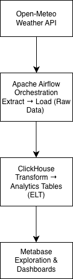
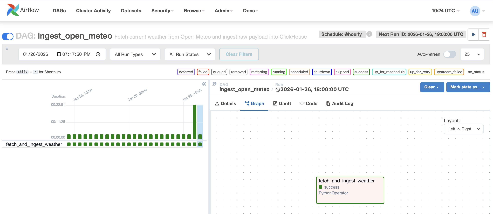
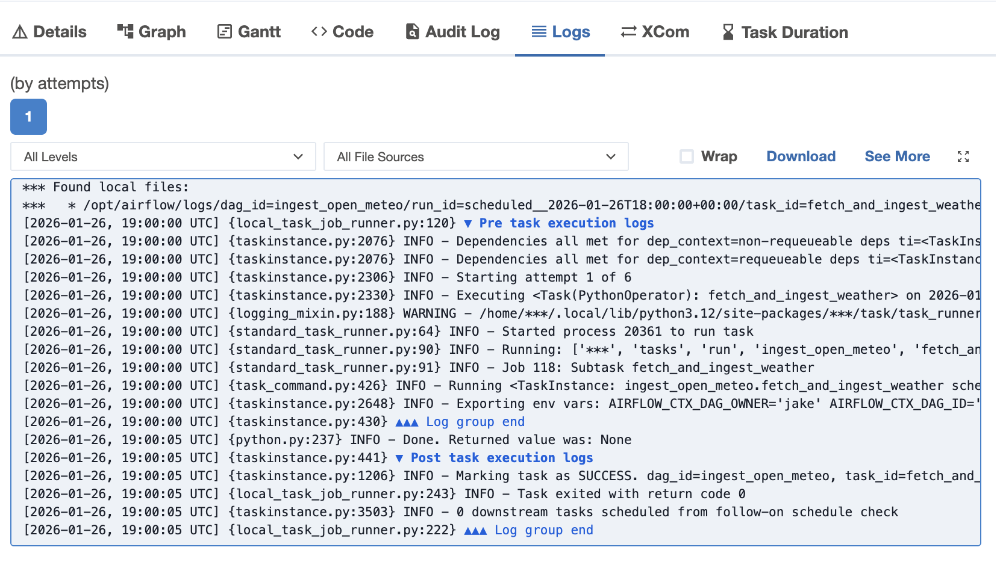
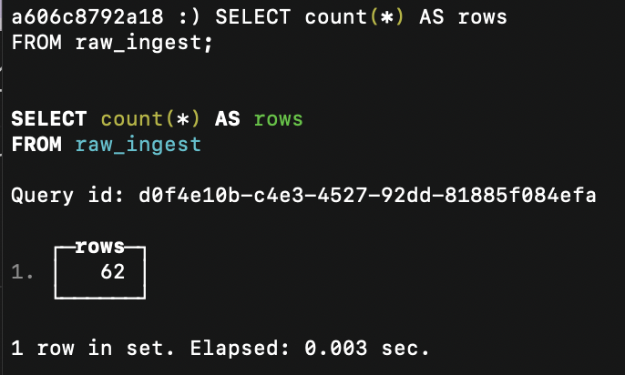
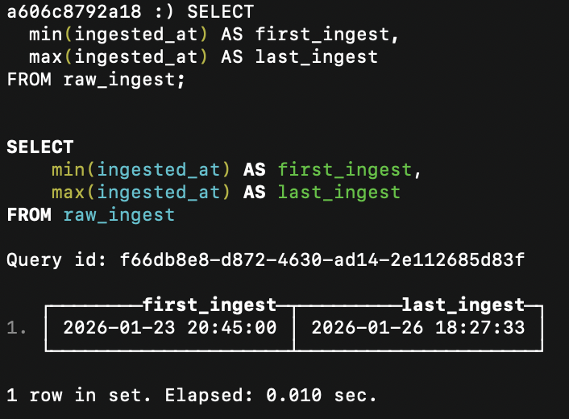
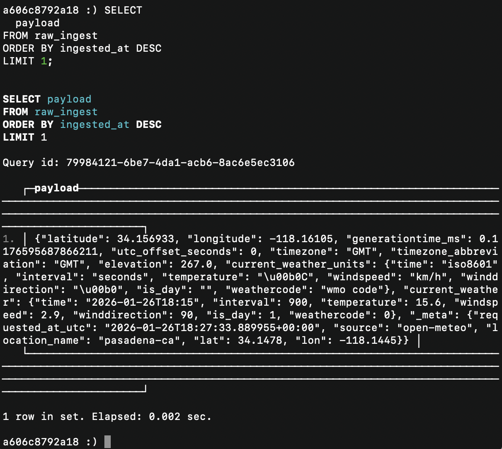
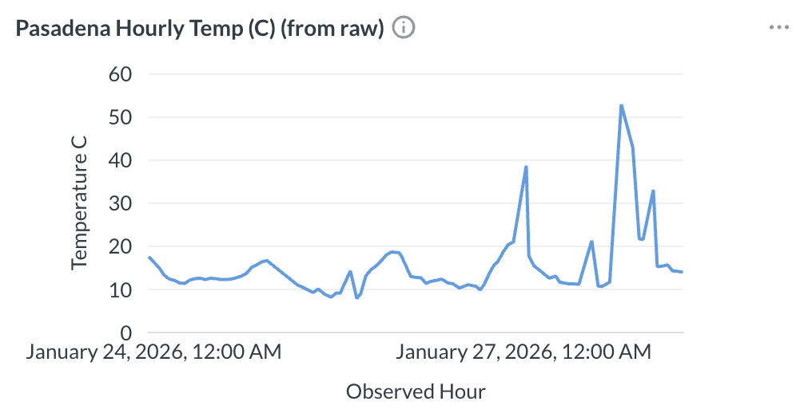
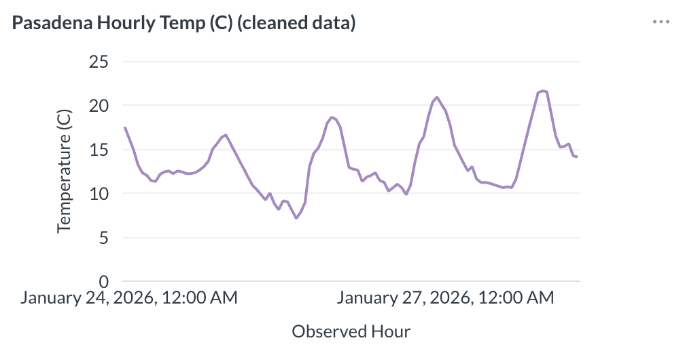
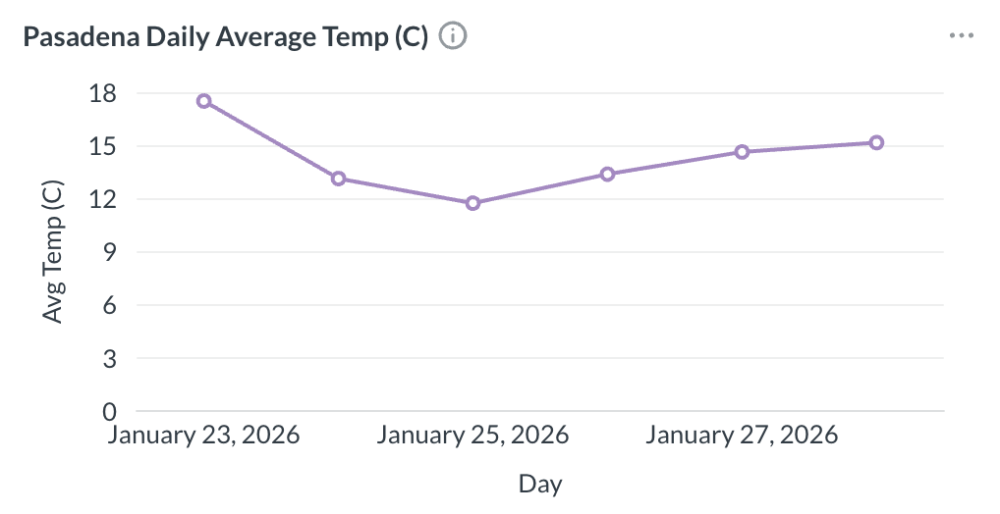
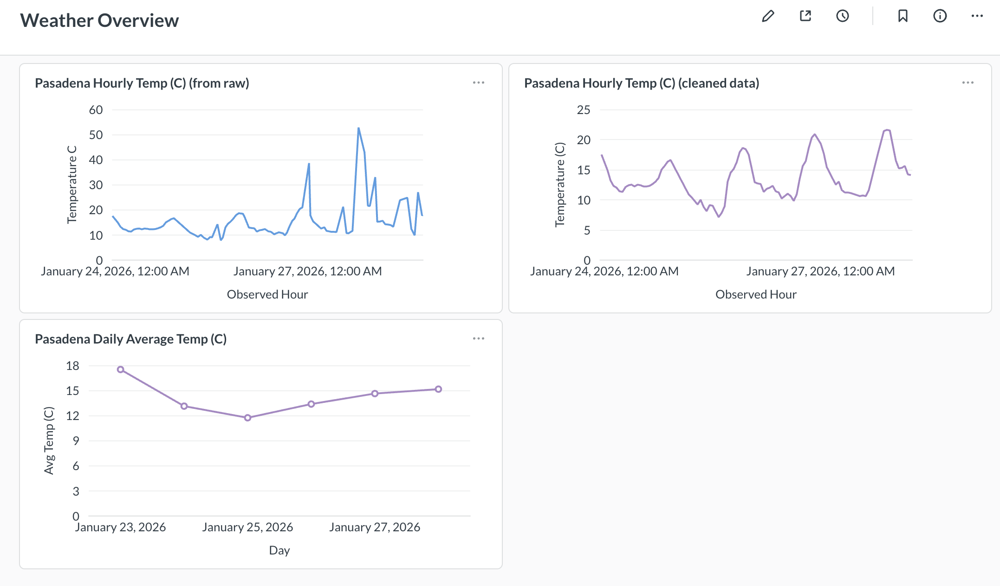

# Modern Analytics Pipeline

## Project Purpose

The purpose of this project is to create a **modern analytics pipeline**.

**Apache Airflow** orchestrates the pipeline. It ingests raw data from **open-meteo** (a weather API), transforms the data with a DAG written in Python, stores the analytics data in **ClickHouse**, and then visualizes it with **Metabase**. This follows a standard ELT pattern.

---

## Project Goals

The major goals were to demonstrate:

- Production-style ELT orchestration with Airflow
- OLAP-optimized storage with ClickHouse
- End-to-end data visibility (DAG → database → dashboard)

---

## What This Project Demonstrates

- End-to-end ELT pipeline design
- Clear separation of orchestration, storage, and visualization
- OLAP-appropriate database choices
- Dockerized local development environment
- Production-style observability

---

## Architectural Overview

Source Data (open-meteo API) 
↓ 
Airflow DAG (Extract → Load raw data) 
↓ 
ClickHouse — Bronze Layer (raw ingestion, append-only) 
↓ 
ClickHouse — Silver Layer (hourly analytics, deduplicated) 
↓ 
ClickHouse — Gold Layer (daily business metrics) 
↓ 
Metabase (Exploration & Dashboards)

### Architecture Diagram

 _High-level architecture overview showing data flow from ingestion to analytics and visualization._

---

## Key Design Decisions

The following decisions were made to prioritize data correctness, flexibility, and observability.

- Chose ELT over ETL to keep raw data immutable and transformations flexible
- Used ClickHouse views for Silver/Gold layers to avoid unnecessary data duplication
- Applied deterministic deduplication to ensure correctness under retries

---

## Technologies Used

- **Apache Airflow** – workflow orchestration and scheduling
- **ClickHouse** – column-oriented OLAP database
- **Metabase** – analytics UI and dashboards
- **Docker / Docker Compose** – containerization
- **Python** – DAGs and data processing
- **SQL** – analytics queries

---

## Airflow Pipeline Orchestration

The Airflow DAG performs the following steps:

1. Extracts source data from **open-meteo**
2. Applies lightweight ingestion-time transformations
   - Metadata enrichment (ingestion timestamp, source attribution)
3. Loads results into a ClickHouse table

_Airflow DAG graph showing successful execution of the ingestion pipeline._

_Task execution log confirming successful data ingestion into ClickHouse._

---

## ClickHouse Analytics Storage

ClickHouse is used to store both raw ingestion data and modeled analytics layers. The database contains a mix of physical tables for durable storage and views for deduplication and metric derivation at query time.

### ClickHouse raw data row count example

_Query result validating number of raw records ingested._

### ClickHouse first/last data ingestion

_Query result proving minimum time range covered by ingested data (as time range continues to grow)._

### ClickHouse example raw payload

_Most recent (at time of screenshot) raw API payload stored in ClickHouse._

---

## Data Modeling & Analytics Layers

This project follows a **Bronze / Silver / Gold** analytics layering pattern inside ClickHouse. This layered approach enables raw data traceability, deterministic analytics, and flexible metric evolution without reprocessing historical data.

### Bronze — Raw Ingestion

- **Table:** `weather.raw_ingest`
- Append-only, source-of-truth
- Contains raw API payloads plus ingestion metadata
- Retries and replays are allowed and expected

No transformations or deduplication are performed at this layer.

---

### Silver — Cleaned Analytics (Hourly)

- **Table:** `analytics.weather_hourly`
- **Engine:** `ReplacingMergeTree`
- **Grain:** 1 row per location per hour

Duplicate observations (caused by retries or re-ingestion) are resolved deterministically using the latest `ingested_at` timestamp.

To guarantee correctness for BI tools, a view is exposed:

- **View:** `analytics.v_weather_hourly`
- Applies `FINAL` at query time to ensure no duplicate rows are ever returned

This layer serves as the **trusted analytics contract** for downstream consumption.

### Deduplication Strategy

Weather observations are uniquely identified by `(location, observed_hour)`. Due to pipeline retries, duplicate rows may exist in raw ingestion.

Deduplication is handled in ClickHouse using:

- `ReplacingMergeTree` for deterministic "latest record wins" behavior
- Query-time enforcement via `FINAL` in analytics views

This ensures:

- Raw data remains immutable
- Analytics queries are always correct
- BI dashboards are protected from duplicate-driven anomalies by construction

---

### Gold — Business Metrics (Daily)

- **View:** `analytics.v_weather_daily`
- Derived from the Silver hourly layer
- Provides daily aggregates such as:
  - Average temperature
  - Min / max temperature
  - Data completeness (`hours_present`)

Gold metrics are implemented as **views**, meaning they are recomputed at query time and always reflect the latest available data.

---

## Metabase Exploration and Dashboards

Metabase connects directly to ClickHouse to provide:

- Table exploration
- Ad-hoc / on-demand queries
- Dashboards for key metrics

### Bronze Exploration (Raw Data)

_Exploration of raw ingested weather payloads (bronze layer)._

Used primarily for:

- Debugging ingestion
- Validating source data
- Identifying anomalies

---

### Silver Analytics — Hourly Weather

_Hourly temperature trends built on the deduplicated silver layer._

This visualization confirms:

- Duplicate rows are resolved
- Time-series data is clean and continuous

---

### Gold Metrics — Daily Aggregates

_Daily average, min, and max temperatures derived from silver analytics._

Gold metrics are recomputed dynamically and always reflect the latest available data.

### Weather Overview — Dashboard

_Tables showing line graphs of bronze, silver, and gold views._

Dashboard clearly shows differences in bronze, silver, and gold visualizations.

---

## Future Improvements

- Add **dbt** transformations for analytics modeling
- Implement incremental loading strategies
- Add data quality checks and Airflow sensors
- Expand Metabase dashboards for increased business metric visibility
- Deploy to managed Airflow / ClickHouse environments

---

## Difficulties Overcome

### Infrastructure & Orchestration

- Airflow PID conflicts
- Gunicorn startup timing
- Container lifecycle confusion
- Volume-mounted state persistence

### Networking

- Service name resolution (`clickhouse`)
- DNS flakiness inside Docker
- External API availability

### Data Modeling & Analytics

- Anomalous data points from raw data (duplicates)
- Deduplication of rows via silver table
- Enforcing correct data grain
- Separation of Bronze, Silver, and Gold analytics layers

### ClickHouse Specifics

- HTTP authentication
- Query formatting
- Insert semantics
- Error codes that are not immediately obvious

### Mental Overhead

- Coordinating multiple distributed components simultaneously
- Diagnosing failures across orchestration, storage, and visualization layers
- Learning when to isolate issues methodically rather than reacting to symptoms
